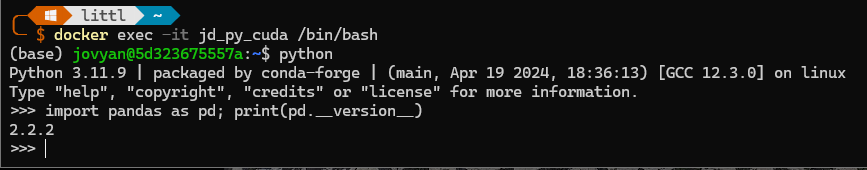
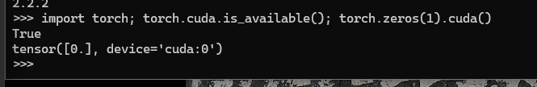

# What is this?

A collection of docker image files created by me to make my life easier.

# Docker quickstart

https://stackify.com/docker-build-a-beginners-guide-to-building-docker-images/

# How to get this running

All the examples are based on building image located in `jupyter-tensorflow-cuda` on the `main` branch.

1. First build the docker image locally

`docker build https://github.com/jakub-deka/docker_repos.git#main:jupyter-tensorflow-cuda -t jakub-deka/jupyter-tensorflow-cuda`

The image should have all you need to get tensorflow running locally on your nvidia GPU.

2. Get the container running based on this image.

`docker run --name jd_py_cuda --gpus all jakub-deka/jupyter-tensorflow-cuda`

If you want to run this image with a mount to a container file system, you need to run it like this:

`docker run --name jd_py_cuda2 --gpus all --mount source=docker_vol,target=/home/jovyan/work jakub-deka/jupyter-tensorflow-cuda`

Additionally, see this https://www.freecodecamp.org/news/docker-mount-volume-guide-how-to-mount-a-local-directory/ & https://stackoverflow.com/questions/23439126/how-to-mount-a-host-directory-in-a-docker-container. It specifies how to mount a folder into a docker container. For example:

`docker run --name jd_py_cuda2 --gpus all -v "${PWD}/exposed_to_docker:/mnt/c/users/current_user/exposed_to_docker" jakub-deka/jupyter-tensorflow-cuda`

This should get it running with the GPU being made available to the container. Exit the interactive window if needed and start the containers again.

`docker start jd_py_cuda`

3. Once the container is running we can check that everything is working.

`docker exec -it jd_py_cuda /bin/bash`

Then

`python`

Then

`import pandas as pd; print(pd.__version__)`

This whould produce something like this

Then lets check if pytorch is working and cuda is working

`import torch; torch.cuda.is_available(); torch.zeros(1).cuda()`

This should yield something like this

You are good to go!

----
You need to be root? Run this!

`docker exec -it --user root -e GRANT_SUDO=yes jd_py_cuda2 /bin/bash`